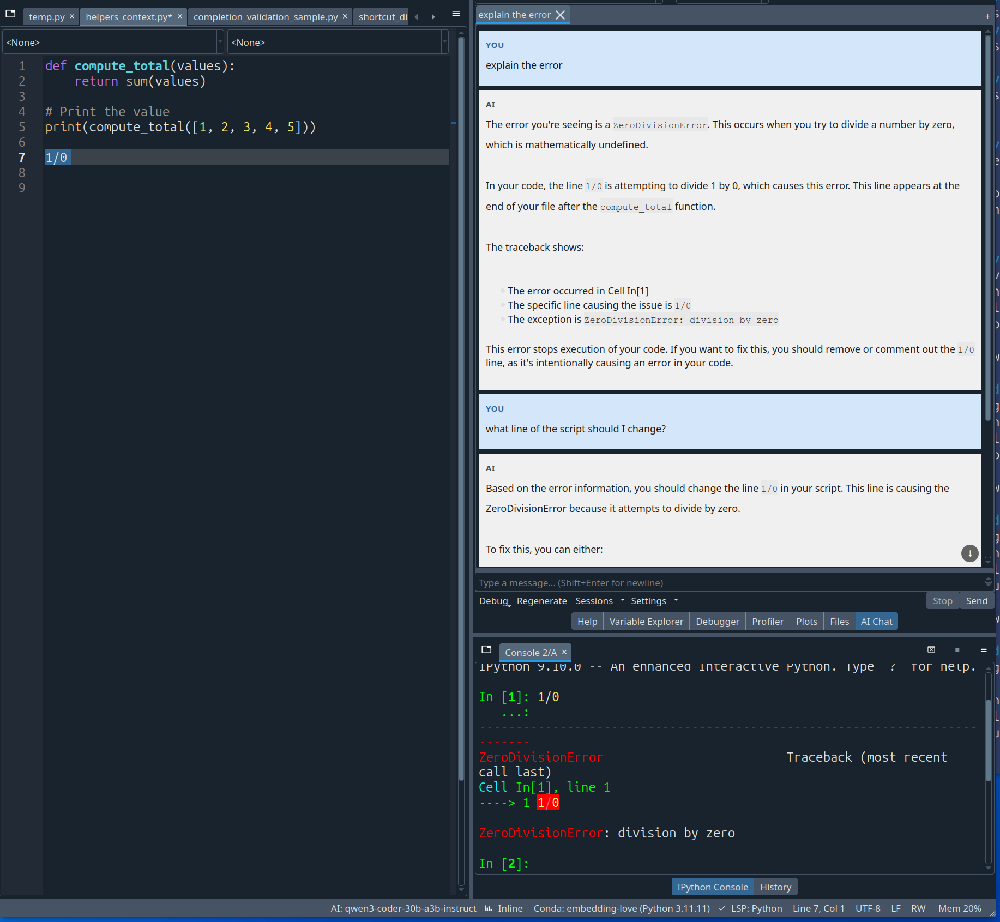
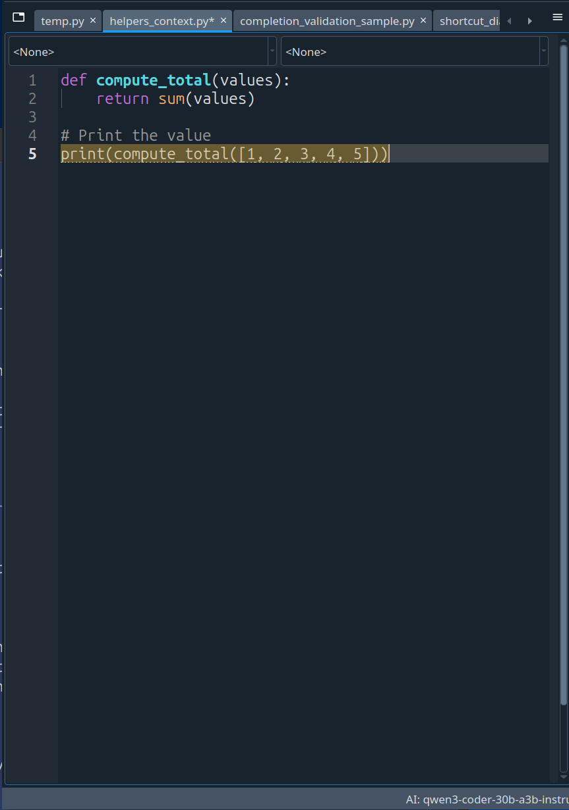

# spyder-ai-assistant

[](https://pypi.org/project/spyder-ai-assistant/)
[]()
[](https://creativecommons.org/licenses/by-nc/4.0/)
[](https://www.spyder-ide.org/)
[](https://www.python.org/)

A local-first AI assistant for [Spyder IDE](https://www.spyder-ide.org/). Chat with a model about your code, get Copilot-style inline completions, inspect live variables and tracebacks, and browse your conversation history — all running on your own GPU through [Ollama](https://ollama.com/), with optional support for OpenAI-compatible endpoints.



---

## Quick start

### 1. Install Ollama and pull a model

```bash
curl -fsSL https://ollama.com/install.sh | sh
ollama pull qwen2.5:7b          # chat model (~5 GB VRAM)
```

> Pick a model that fits your GPU. See [model recommendations](#model-recommendations) below for more options.

### 2. Install the plugin

```bash
pip install spyder-ai-assistant
```

> Install into the **same Python environment** where Spyder lives (e.g. your conda env).

### 3. Restart Spyder and open the chat

The plugin registers automatically. After restart:

- Open the chat panel: **View > Panes > AI Chat**
- Pick your model from the toolbar dropdown
- Start typing — inline completions appear automatically as ghost text

**To manually trigger an inline suggestion:** press `Ctrl+Shift+Space`.

That's it. Everything runs locally and works offline.

> **Optional:** to use cloud or self-hosted chat endpoints, open **AI Chat > More > Provider Profiles...** and add one or more OpenAI-compatible profiles.

---

## Features

### Inline code completions

Copilot-style ghost text that appears as you type, powered by Ollama's Fill-in-Middle (FIM) API.



| Shortcut | Action |
|----------|--------|
| `Ctrl+Shift+Space` | Manually trigger a suggestion |
| `Tab` | Accept the full suggestion |
| `Alt+Right` | Accept next word |
| `Alt+Shift+Right` | Accept next line |
| `Escape` | Dismiss |

The provider is tuned beyond a basic API call: it caches recent prompts, trims suffix overlap so brackets aren't duplicated, filters repetitive output, pulls relevant snippets from other open files for richer context, suppresses Spyder's native popup when a ghost suggestion is active, and cycles through alternative candidates locally without extra model round-trips. The status bar shows the active completion model and its state (`generating`, `offline`, or ready).

### Chat panel

A dockable pane for talking to a model about your code. Open it from **View > Panes > AI Chat**.

- **Multi-tab sessions** — each conversation lives in its own tab
- **Streaming responses** — tokens arrive in real time
- **Syntax-highlighted code blocks** — with copy, insert-at-cursor, and replace-selection actions
- **Thinking/reasoning display** — models that emit `<think>` blocks (QwQ, DeepSeek-R1, etc.) show their reasoning in a dimmed section
- **Per-tab chat modes** — switch between Coding, Debugging, Review, Data Analysis, Explanation, or Documentation presets
- **Per-tab inference settings** — override temperature and max tokens for individual tabs
- **Mid-conversation model switching** — change models from the toolbar without losing context
- **Stop and regenerate** — cancel a response mid-stream, or rerun the last turn
- **Delete individual exchanges** — remove any saved turn from the conversation
- **Export to Markdown** — save any session with full metadata

### Kernel integration and runtime inspection

The chat panel has read-only access to your active Spyder IPython session. It can inspect:

- **Tracebacks and errors** — the latest exception from your kernel
- **Console output** — recent visible output from your IPython session
- **Live variables** — the current variable list and targeted inspection of specific variables by name
- **Structured runtime values** — arrays, images, DataFrames, Series, and bounded nested-container previews
- **Kernel state** — shown in the chat toolbar so you always know what's running
- **Multiple consoles** — the toolbar can follow the active console or pin runtime inspection to a different open console

This is **on-demand, not automatic** — ordinary questions stay file-focused and lean. The AI only pulls runtime state when the question actually depends on it, and it never executes code on your behalf.

**Quick-action buttons** for common debugging workflows:

| Control | What it does |
|--------|-------------|
| **Debug** | Opens runtime-aware actions such as Explain Error, Fix Traceback, Use Variables, and Use Console |
| **Regenerate** | Reruns the last turn on the active tab |

When more than one IPython console is open, the runtime target selector in the chat toolbar lets you choose **Follow Active Console** or pin the debugging context to a specific console. The runtime tooltip shows which console is currently active and which one is actually being inspected.

### Editor integration

The AI automatically sees your current file, cursor position, selection, other open tabs, and your project's file tree. Right-click any selection for AI actions:

| Action | What it does |
|--------|-------------|
| **Ask AI** | Opens chat with your selection as context |
| **Explain** | Explains the selected code |
| **Fix** | Finds and fixes bugs in the selection |
| **Add Docstring** | Generates a docstring for the selected function or class |

Code blocks in chat responses now expose **Copy** and **Apply...**. `Apply...` opens a preview dialog that lets you choose insert-vs-replace, inspect the diff, and confirm or cancel before the editor changes. The final mutation is grouped into a single undo step.

### Session history and persistence

Chat sessions save automatically. When a Spyder project is open, conversations persist in `.spyproject/ai-assistant/chat-sessions.json` and restore when the project reopens. Without a project, sessions fall back to a global store.

The **Sessions** button keeps session actions in one place. Its history browser lets you search, filter, sort, reopen, duplicate, or delete saved sessions. Per-tab chat modes and inference overrides persist with each session.

### Multi-provider support

By default, everything runs through Ollama. For chat, you can also manage multiple named OpenAI-compatible profiles from **AI Chat > More > Provider Profiles...**.

- each profile has its own label, endpoint, API key, and enabled state
- the shared model selector groups entries by provider/profile and keeps endpoint details in the tooltip
- the status label reports provider issues without hiding working models
- removing a stale profile falls back cleanly to another available model

Inline completions stay Ollama-backed for low latency.

---

## Model recommendations

### Chat models

Pick one that fits your GPU:

| VRAM | Model | Command |
|------|-------|---------|
| 8 GB | Qwen 2.5 7B | `ollama pull qwen2.5:7b` |
| 12 GB | Qwen 2.5 14B | `ollama pull qwen2.5:14b` |
| 16 GB+ | Qwen 3.5 27B | `ollama pull huihui_ai/qwen3.5-abliterated:27b` |

### Completion models (optional)

A smaller, faster model for inline suggestions. Recommended but not required — the chat model handles completions if no separate model is configured.

| VRAM | Model | Command |
|------|-------|---------|
| 8 GB | Qwen 2.5 Coder 3B | `ollama pull qwen2.5-coder:3b` |
| 12 GB+ | Qwen3 Coder 30B (3B active) | `ollama pull qooba/qwen3-coder-30b-a3b-instruct:q3_k_m` |

### GPU and memory

Ollama uses your GPU automatically if CUDA or ROCm drivers are installed. Rough VRAM requirements for Q4_K_M quantized models:

| Model size | VRAM needed | Typical use |
|-----------|-------------|-------------|
| 3B | ~2.5 GB | Completions |
| 7B | ~5 GB | Basic chat |
| 14B | ~9 GB | Good chat |
| 27B | ~15 GB | Excellent chat |

Running chat and completions simultaneously keeps both models in VRAM. A 7B chat + 3B completion model needs about 7.5 GB total. Without a GPU, Ollama falls back to CPU (slower but functional).

---

## Configuration

All settings live in **Preferences**:

- **Preferences > AI Chat** — default chat provider, Ollama server URL, model names, temperature, max tokens, keyboard shortcuts, system prompt, and action prompt templates (with `{filename}` and `{code}` placeholders)
- **Preferences > Completion and linting > AI Chat** — completion toggle, model, temperature, max tokens, debounce delay

OpenAI-compatible chat endpoints are managed directly from the chat pane through **More > Provider Profiles...**. Existing single-endpoint settings are imported automatically the first time you open that dialog.

Per-tab chat modes and inference overrides are set directly in the chat pane and persist with the session.

---

## Troubleshooting

**"No models found" in the dropdown** — Run `curl http://localhost:11434/api/tags` to check Ollama, or pull a model with `ollama pull qwen2.5:7b`. For OpenAI-compatible profiles, open **More > Provider Profiles...** and confirm the endpoint responds on `/v1/models`.

**Completions aren't appearing** — Enable them in Preferences > Completion and linting > AI Chat. The status bar should show `AI: model-name`. If it says `AI: offline`, Ollama isn't reachable.

**Chat panel doesn't show up** — Check View > Panes for "AI Chat". If missing, the plugin may be in a different Python env than Spyder. Verify: `python -c "import spyder_ai_assistant; print('OK')"`.

**Slow responses** — Try a smaller model. Check `nvidia-smi` for GPU usage. First requests are always slower while the model loads into VRAM.

**Too much VRAM** — Run `ollama ps` to see loaded models and `ollama stop <model>` to unload.

**Runtime inspection returns generic answers** — Use a stronger instruction-following model. The runtime bridge requires the model to emit structured inspection requests. Qwen-based models handle this reliably.

---

## Roadmap

Active development. Rough priority order:

- **Session management** — pinning, labeling, bulk operations
- **More providers** — adapters beyond OpenAI-compatible, profile import/export, provider health checks
- **Smart setup** — one-click Ollama install, guided model downloads, hardware-aware recommendations
- **Smarter completions** — scope-aware truncation, rename-aware suggestions, multi-site edits
- **Polish the apply workflow further** — richer inline diff rendering, smarter multi-block edit handling
- **Agent workflows** — multi-step task execution with approval gates, git-aware context

---

## Contributing

See [CONTRIBUTING.md](CONTRIBUTING.md) for development setup, architecture overview, validation workflow, and release process.

---

## License

[Creative Commons Attribution-NonCommercial 4.0 International](https://creativecommons.org/licenses/by-nc/4.0/). Free to use, share, and adapt for non-commercial purposes with attribution. See [LICENSE](LICENSE).
